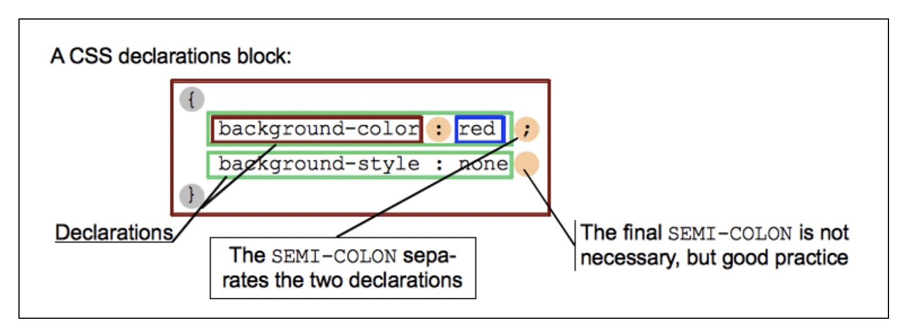
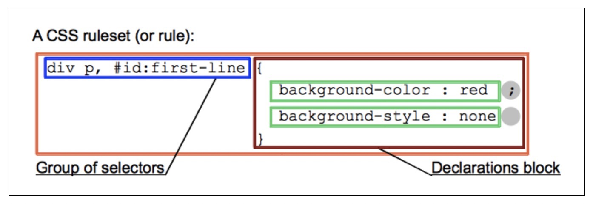
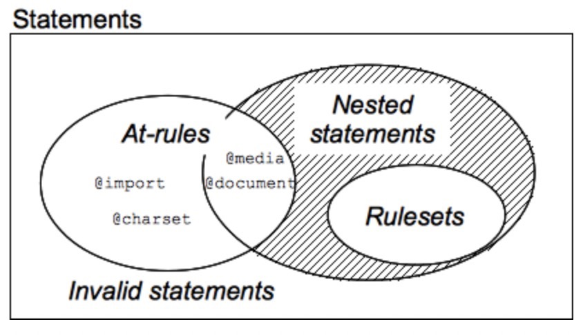

# 层叠样式表(Cascading Style Sheets)

## 了解CSS

- [CSS 关键词列表][CSS Reference]
- 定义：用来控制网页在浏览器中的显示外观的声明式语言
- 作用：定义 html/svg/xml 样式
  - layout 排版布局----分区
  - styling 颜色样式---涂色
- 组成：选择器/属性/值
- 使用方式：
  - 外部样式表
  - 内部样式
  - 内联样式
- 关键点
  - 属性和值
    - 属性：一个标识符，用可读的名称来表示其特性
    - 值：描述了浏览器引擎如何处理该特性。包含一个有效值的集合，有正式的语法和语义定义，被浏览器引擎实现
    - 每对中的属性和值由冒号:分隔。
  - 优先级：多个选择器规则匹配到相同的HTML节点，样式的权重
  - 函数: 有一些可能的**值**以函数的形式出现
  - @规则: 提供了一些关于如何表现CSS的指导。
  - 速记属性（简写）
  - /*注释*/
  - 空白: 实际空格、制表符和新行，忽略CSS中的大部分空白。
  
- CSS如何运行 ?
  - 载入HTML文件
  - HTML文件转化成一个DOM（DOM文件在计算机内存中的表现形式）
  - 浏览器会拉取该HTML相关的大部分资源
    - img/video/js/css
  - 取到CSS之后会进行解析
    - 不同类型（比如element、class、id等等）把他们分到不同的“桶”中
    - 基于“桶”找到的不同的选择器，应用在对应的DOM的节点中
    - 添加节点依赖的样式(渲染树)
  - 渲染树会依照应该出现的结构进行布局
  - 网页展示在屏幕上(着色)
- 无法解析的CSS代码会发生什么?
  - 浏览器什么也不会做，继续解析下一个CSS样式！
    - 属性写错/或者不支持
  - 可以做浏览器兼容

- 其他语法关键字
  -语法和语义
  - CSS 语法：属性和值
  - @规则：提供了一些关于如何表现CSS的指导。
  - 层叠
  - 注释： /*注释*/
  - 选择器：用于识别所匹配的的HTML节点的
  - 继承
  - 简写属性（简写）：可以同时设置好几个值的属性，更具可读性，节省时间和精力
  - 优先级： 多个选择器规则匹配到相同的HTML节点，样式的权重
  - 值定义语法
  - CSS 单位与取值类型
  - 值
    - 实际值
    - 计算值
    - 初始值
    - 解析值
    - 指定值
    - 使用值
  - 布局
    - 块级格式化上下文
    - 盒式模型
    - 包含块
    - 布局模式
    - 外边距合并
    - 替换元素
    - 层叠上下文
    - 视觉格式化模型

## 知识点

### CSS语法

- [语法定义][CSS Syntax]

  ```css
    style-rule ::=
        selectors-list {
          properties-list
        }

    selectors-list ::=
        selector[:pseudo-class] [::pseudo-element]
        [, selectors-list]

    properties-list ::=
        [property : value] [; properties-list]

    # 示例
    strong {
      color: red;
    }

    div.menu-bar li:hover > ul {
      display: block;
    }
  ```

- css语法组成
  - 声明 `(属性：值)` declaration
  
    - 属性：一个标识符，用可读的名称来表示其特性
    - 值：描述了浏览器引擎如何处理该特性。包含一个有效值的集合，有正式的语法和语义定义，被浏览器引擎实现
    - 每对中的属性和值由冒号:分隔。
  - 声明块 `(用{}块状组合声明)`  declaration block
  
  - 规则集 `(选择器列表+声明块)` ruleset
  
    - 一个HTML节点可能被多个选择器选中
    - 有多个规则以不同的值去设置同一属性（层叠（cascade) 算法）
  - 语句（规则+@规则）
  

- 描述
  - 属性名还是属性值都是对大小写不敏感
  - 属性与值前面、后面与两者之间的空白不是必需的
  - 每个属性都定义了它的合法值

### 层叠与继承

建立对 层叠、优先级、继承的理解、

- 冲突规则---只会覆盖相同属性，不会覆盖对应的选择器
  - 一定要注意样式选择器规的应用
- 层叠/嵌套，css规则的顺序很重要
  - 同优先级：后面的规则覆盖前面的规则
- 优先级
  - 具体 > 模糊
  - 属性优先级计算规则(分量相加)
    - 千位： style 的属性（**内联样式**）则该位得一分。这样的声明没有选择器，所以它得分总是1000。
    - 百位： 选择器中包含ID选择器则该位得一分。
    - 十位： 选择器中包含类选择器、属性选择器或者伪类则该位得一分。
    - 个位： 选择器中包含元素、伪元素选择器则该位得一分。
    - 注意：
      - 在进行计算时不允许进行进位
      - (*) 、 (+, >, ~, ' ')、 (:not) 不会影响优先级。

      | 选择器  | 千 | 百  | 十 | 个 | 总|
      | --- | --- | --- | --- | --- |--- |
      | `h1`  | 0 | 0 | 0 | 1 | 0001 |
      | `h1 + p::first-letter` | 0| 0|0|3|0003|
      | `li > a[href*="en-US"] > .inline-warning` | 0| 0|2|2|0022
      | `h1 + p::first-letter` | 0| 0|0|3|0003
      | `#id` | 0 | 1 | 0 | 0 | 0100|
      | `<h1 style="color:red;">` | 1 | 0 | 0| 0| 1000|
  - `!important`
    - 可以覆盖任何基础优先级
    - 覆盖 !important 唯一的办法就是另一个 !important 具有 相同优先级 而且顺序靠后，或者更高优先级。
    - 强烈建议除了非常情况不要使用
- 继承
  - 一些设置在父元素上的css属性是可以被子元素继承的
  - 控制继承
    - inherit "开启继承"
    - initial 和浏览器默认样式相同
    - unset 将属性重置为自然值（如果属性最开始继承是 inherit，否则和 initial一样）
    - revert
    - “all” 属性，重设所有属性值

### CSS选择器

各种类型的CSS选择器，以供我们精确选出要添加样式的元素

- 基本选择器
  - 通用选择器 `*, ns|*, *|*`
  - 选择器列表 `A, B` 多个选择器可以用(,)隔开，应用同一个声明块
  - 标签Tag 选择器 `h1`
  - Class 选择器 `.box`
  - Id 选择器 `#box`
  - 标签属性选择器 `a[title]`
    - `[attr]`
    - `[attr=value]`
    - `[attr~=value]`
    - `[attr|=value]`
    - `[attr^=value]`
    - `[attr$=value]`
    - `[attr*=value]`
  - 运算符  `+ > ~ ||` 一组选择器可以将其他选择器组合起来
    - `A B` 后代选择器
    - `A > B` 直接子代组合器
    - `A ~ B` 一般兄弟组合器
    - `A + B` 紧邻兄弟组合器
    - `A || B` 列组合器
  - 伪类与伪元素
    - [伪类(Pseudo Class)][Pseudo Class] `a:hover` 样式化当前元素的特定状态
    - [伪元素(Pseudo Elements)][Pseudo Elements] `p::first-line` 选择一个元素的某个部分而不是元素自己
      - 一个选择器中只能使用一个伪元素
      - 伪元素必须紧跟在语句中的简单选择器/基础选择器之后
      - 应该使用双冒号（::）而不是单个冒号（:），于旧版本的 W3C 规范并未对此进行特别区分，可一起用

### 盒模型

CSS都是包在盒子里的

- 正常文档流：块级盒子（Block box） 和 内联盒子（Inline box）
  - 对盒子 display 属性的设置，比如 inline 或者 block
  - Block
    - 和父容器一样宽
    - 会换行
    - width/height 正常
    - padding/margin/border 会将其他元素从当前盒子周围“推开”
  - Inline
    - 盒子不会产生换行。
    - width/height 无效。
    - 垂直方向 padding/margin/border 会被应用，不会把其他处于 inline 状态的盒子推开
    - 水平方向 padding/margin/border 会被应用，会把其他处于 inline 状态的盒子推开
  - inline-block（block/inline中间状态）
    - 不会跳转到新行
    - width/height 正常，只会比其内容更大
    - padding/margin/border 会推开其他元素
- 内部和外部显示类型
  - 外部显示类型：决定盒子外部是块级还是内联。
  - 内部显示类型：决定盒子内部元素是如何布局的
- CSS 盒模型
  - Content box: 这个区域是用来显示内容。大小：width / height
  - Padding box: 包围在内容区域外部的空白区域； 大小： padding
  - Border box: 边框盒包裹内容和内边距。大小： border
  - Margin box: 这是最外面的区域，是盒子和其他元素之间的空白区域。大小： margin
- 标准盒模型
  - `box-sizing: content-box`
  - 实际 width = style 设置的 width + padding(t/b) + border(t/b)
- 替代（IE）盒模型
  - `box-sizing: border-box` 按 border box设置大小
  - 实际 width = style 设置的 width
    - 当存在 `padding/border` 时会压缩content box大小
- [包含块(Containing Block)][Containing Block]: 这个元素最近的祖先块元素的content box内容区
  - 作用
    - 元素的尺寸及位置 width/padding/border
    - 绝对定位元素的偏移值（absolute/fixed）top值等
    - 百分比单位是根据 content box 大小
  - 确定包含块：完全依赖于这个元素的 position 属性
    - position: `static/relative/sticky`
      - 它的最近的祖先**块元素**
      - 可能会建立格式化上下文, table/flex/grid 容器
    - position: `absolute`
      - 它的最近的 position != static 祖先元素的 内边距区的边缘组成
    - position: `fixed`
      - (continuous media) 是 viewport ,
      - (paged media) 是分页区域(page area)
    - position: `absolute | fixed` 可能是满足以下条件的最近父级元素的内边距区的边缘
      - transform/perspective != none
      - will-change  = transform | perspective
      - filter != none 或者 will-change = filter (Firefox)
      - contain = paint
  - 百分值: 计算值是由这个元素的包含块计算
    - height/top/bottom
      - 包含块的 height 的值
      - 包含块的 height 值会根据它的内容变化，且position:relative|static, 该元素百分比为auto
    - width/left/right/padding/margin
      - 包含块的 width 的值
- margin: 外边距是盒子周围一圈看不到的空间,把其他元素从盒子旁边推开
  - 可以 正/负 值，负值可能会导致重叠
  - 外边距总是在计算可见部分后额外添加
  - [外边距折叠(Margin Collapsing)][Margin Collapsing]
    - 两个外边距相接的元素，这些外边距将合并为一个外边距（最大边距）
    - 折叠规则
      - 同一层相邻元素之间
        - 相邻的两个元素之间的外边距重叠(除非后一个元素加上clear-fix清除浮动。)
      - 没有内容将父元素和后代元素分开
      - 空的块级元素
- border
  - 边框是在边距和填充框之间绘制
  - 设置包括：`width/style/color`
- padding
  - 边框和内容区域之间
  - 内边距通常用于将内容推离边框
  - 任何背景都将显示在内边距后面
  - 不能有负数量的内边距(0,正直)

### 视觉格式化模型

### 值与单位

[CSS Syntax]: <https://developer.mozilla.org/zh-CN/docs/Web/CSS/Syntax> (CSS Syntax)
[CSS Reference]: <https://developer.mozilla.org/zh-CN/docs/Web/CSS/Reference> (CSS Reference)
[Containing Block]: <https://developer.mozilla.org/zh-CN/docs/Web/CSS/Containing_block> (Containing Block)
[Pseudo Classes]: <https://developer.mozilla.org/zh-CN/docs/Web/CSS/Pseudo-classes> (Pseudo Classes)
[Pseudo Elements]: <https://developer.mozilla.org/zh-CN/docs/Web/CSS/Pseudo-elements> (Pseudo Elements)
[Margin Collapsing]: <https://developer.mozilla.org/zh-CN/docs/Web/CSS/CSS_Box_Model/Mastering_margin_collapsing> (Margin Collapsing)
