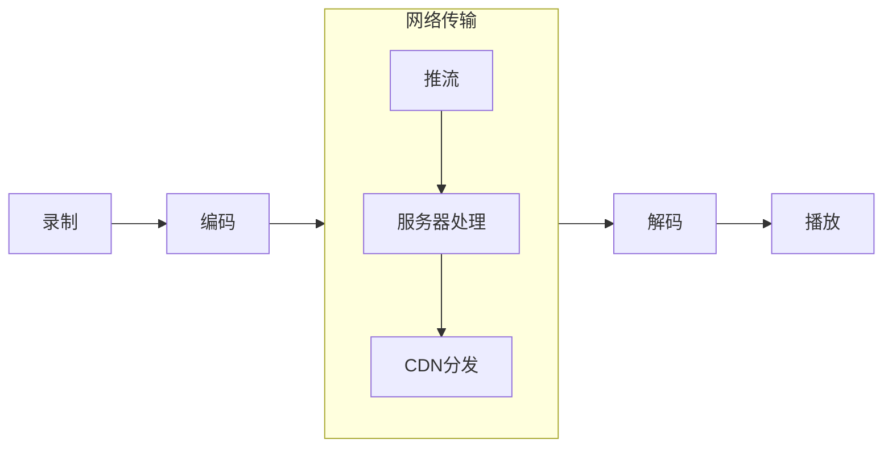

# web直播

## 资料

- [Web直播，你需要先知道这些](https://zhuanlan.zhihu.com/p/44017260)
- [可以用WebRTC来做视频直播吗？](https://www.zhihu.com/question/25497090/answer/719167680)
- [zego 音视频技术社区](https://www.zhihu.com/column/c_1281633204223877120)
- [音视频直播技术](https://www.zhihu.com/column/garrylee)
- [WebRTC深度分析](https://www.zhihu.com/column/c_1242243228008693760)
- [音视频技术入门](http://www.52im.net/thread-1620-1-1.html)

## 直播介绍

- 直播流程

- 技术关键词
  - IPB：一种常用的视频压缩方案
    - 定义：用I帧表示关键帧，B帧表示前向差别帧，P帧表示双向差别帧
  - GOP (Group of Pictures)
    - 定义：GOP 越长（I帧之间的间隔越大），B 帧所占比例越高，编码的率失真性能越高。虽然B帧压缩率高，但解码时CPU压力会更大。
  - 音视频直播质量衡量
    - 内容延时
    - 首帧时长
    - 卡顿（流畅度）
  - 音视频实现的难点
    - 网络环境
    - 多人连麦
    - 主辅路
    - 浏览器兼容性
    - CDN支持
  - MSE(Media Source Extensions)
    - W3C 标准API，解决 HTML5 的流问题
    - HTML5 原生仅支持播放 mp4/webm 非流格式，不支持 FLV
  - Codec
    - 多媒体数字信号编码解码器，能够对音视频进行压缩（CO）与解压缩( DEC )
    - 好处
      - 能有效减少数字存储占用的空间，
      - 使用硬件完成CODEC可以节省CPU的资源，提高系统的运行效率
    - 常用视频编码
      - MPEG、H264、RealVideo、WMV、QuickTime
    - 常用音频编码
      - PCM、WAV、OGG、APE、AAC、MP3、Vorbis、Opus
  - 视频格式/封装格式/容器格式
    - 一种承载视频的格式
    - 主要有：flv、avi、mpg、vob、mov、mp4
    - 视频是用什么方式进行编解码的，与Codec相关

- 直播方案
  - RTMP协议
    - 基于TCP
    - adobe垄断，国内支持度高
    - 浏览器端依赖Flash进行播放
    - 2~5秒的延迟
  - RTP协议 Real-time Transport Protocol
    - 基于UDP
    - IETF于1996提出的一个标准
    - 实时性强
    - 用于视频监控、视频会议、IP电话
    - CDN厂商、浏览器不支持
  - HLS 协议 Http Live Streaming
    - 苹果提出的基于HTTP的流媒体传输协议
    - HTML5直接支持(video)，适合APP直播，PC断只有Safari、Edge支持
    - 必须是H264+AAC编码
    - 因为传输的是切割后的音视频片段，导致内容延时较大
  - flv.js
    - Bilibli开源，解析flv数据，通过MSE封装成fMP4喂给video标签
    - 编码为H264+AAC
    - 使用HTTP的流式IO(fetch或stream)或WebSocket协议流式的传输媒体内容
    - 2~5秒的延迟，首帧比RTMP更快
  - WebRTC协议
    - 基于UDP，低延迟，弱网抗性强，比flv.js更有优势
    - Google力推，已成为W3C标准
    - 现代浏览器支持趋势，X5也支持（微信、QQ）
    - 支持Web上行能力
    - 编码为H264+OPUS
    - 提供NAT穿透技术（ICE）

- 技术实现方案
