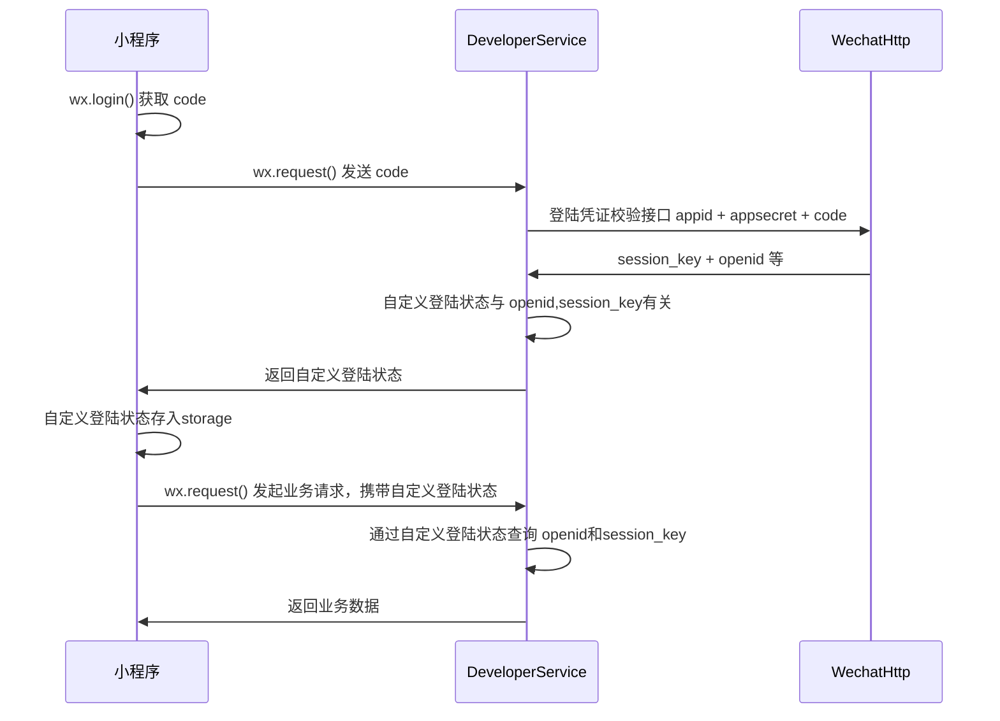
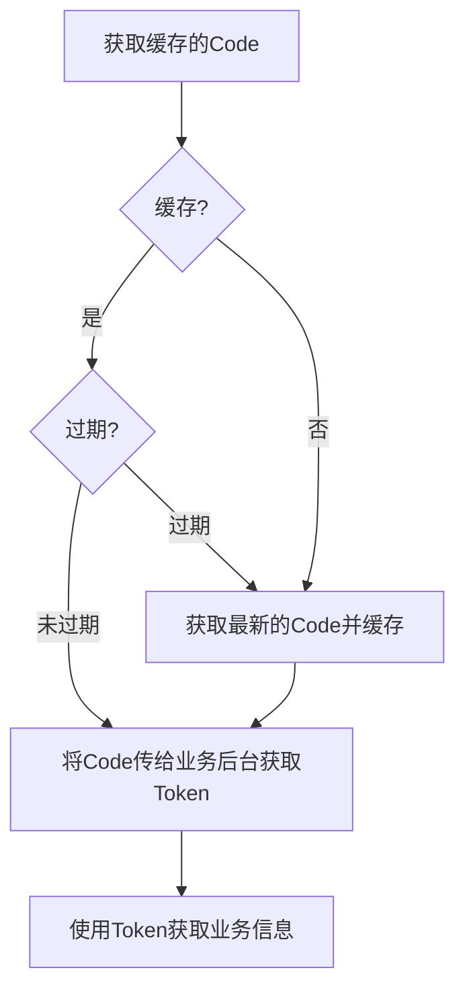

# 小程序 登录

## 微信登录

- [小程序登陆](https://developers.weixin.qq.com/miniprogram/dev/framework/open-ability/login.html)
- [wx.login](https://developers.weixin.qq.com/miniprogram/dev/api/open-api/login/wx.login.html)
- [获取用户信息调整](https://developers.weixin.qq.com/community/develop/doc/000cacfa20ce88df04cb468bc52801)
- [wx.getUserProfile](https://developers.weixin.qq.com/miniprogram/dev/api/open-api/user-info/wx.getUserProfile.html)
  
### 登录流程时序



### 关键信息

- session_key
  - 作用
    - 可用于服务器生成业务token
  - 如何获取？
    - wx.login 获取 code，code获取openid与session_key
  - 特点：会过期
    - 过期机制：是否频繁使用该小程序
    - 通过 wx.checkSession 来判断是否过期
      - 如果过期可使 wx.login 重新获取
    - 注意login code与后端使用时效为1次，如果该code被用于解密后，即使checkSession正常，code仍然无法使用，需要重新获取
- wx.getUserProfile 获取用户信息
  - 注意：必须只能放在 button bindtap 回调里，且不能放在 其他promise执行之后

### 小程序端登陆授权

#### 流程



#### 具体代码

```javascript
a
```

### 服务端流程

## 抖音小程序

- [登录文档](https://microapp.bytedance.com/docs/zh-CN/mini-game/develop/open-capacity/log-in/tt-login/)

## 百度小程序

- [登录文档](<https://smartprogram.baidu.com/docs/develop/function/login_learn/>>> 登录API：api/v1/registers/baidu_program/<%=appid%>?code=<%=code%>)

## 快手小程序

- [登录文档](https://mp.kuaishou.com/docs/develop/guide/thirdPartyLogin.html#%E5%B0%8F%E7%A8%8B%E5%BA%8F%E7%99%BB%E5%BD%95%E6%B5%81%E7%A8%8B)
