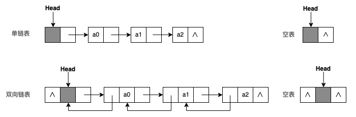

# 线性表-链式存储

线性表的使用[链式存储](/notebook/docs/computer/code-design/data-structure/data-basic#链式存储结构)实现,一般称为<t c1>链表</t>。链表是进阶学习其他结构的核心基础，必须要掌握清楚。

## 参考资料链接

- [C语言 指针基础](http://c.biancheng.net/c/80/)
- [5分钟看懂什么是 malloc](https://zhuanlan.zhihu.com/p/105090421)
- [C语言 malloc函数与指针](https://zhuanlan.zhihu.com/p/197918331)
- [单链表完整代码 0204_LinkList/main.c](https://60f2cac42d-share.lightly.teamcode.com)
- [双向循环链表完整代码 0208_DuLinkList/main.c](https://60f2cac42d-share.lightly.teamcode.com)

## 知识点

- 数据元素<t bg1>逻辑相邻物理存储不一定相邻</t>。又称为非顺序存储。
- 由于存储位置不相邻，不能像顺序存储一样，使用位置来表示逻辑相邻关系。因此每一个结点中，需要添加额外数据（指向逻辑相邻元素的地址），来表示逻辑相邻。所以一个数据元素，分为两部分。<t c2>数据域</t>、<t c2>指针域</t>。


- 通常，我们把<t c2>链表画成箭头相连的结点序列</t>。箭头表示指向某结点的指针。如下图所示：


- 整个链表的存取必须从<t b bg1>头指针</t>开始。头指针指向链表第一个结点（或者头结点）。
- 由于链表中最后一个结点无直接后续，因此最后一个结点的指针指向"空"<t c2>NULL</t>。


- 在链表第一个结点之前添加一个结点，叫<t b bg1>头结点</t>。<t fS cG>(注意头结点与头指针的区别)</t>
  - 头结点的数据域可以放入一些表长度等信息，也可以不放任何信息。
  - <t c2>头结点的指针，指向链表中第一个结点。</t>
  - 注意：<t c3>头结点不是链表的第一个结点！</t>头结点是不算做线性表长度的。
- 链表为空条件是：<t b c1>头指针为NULL</t>（或者仅有一个头结点的链表）
- 单链表中，取得第i个元素，必须从头指针出发寻找。因此<t c2>单链表是非随机存取的存储结构</t>。
- 使用链表时，更加关注元素在表中的逻辑顺序，而不是元素在存储器中的实际位置。
- 链表是一种<t b c2>动态结构</t>。在添加结点时申请空间，在删除结点时释放空间。<t fS cG>（空间释放后可以重复）</t>

:::tip 总结

1. 插入或者删除时，只需要改动指针即可，<t c1>修改效率高</t>。
2. 无法随机获取某一个元素，<t c1>查询效率低</t>
3. 除结点数据外，还需存储额外指针信息，<t c2>空间利用率低</t>。
:::

## 链表表的基本分类

在实际应用中，链表有多种变体。一般在没有明确标明的情况下，都是指的是单链表。每一种类型的链表都是在单链表的基础上，进行了改动。但总体上来说，都是线性表的链式结构。需要在不同情况下，选择的合适的链表。链表有如下分类。

<markmap
  bg
  readOnly
  height="240px"
  md={`- 链表分类
    - 按是否有头结点
      - <span class="c-1">带头链表</span>
      - 无头链表
    - 按是否有指向前驱结点
      - 单向链表
      - 双向链表
    - 按是否循环
      - 非循环链表
      - 循环链表
        - 单向循环链表
        - <span class="c-1">双向循环链表</span>
    - 是否是使用数组描述“链表”
      - 数组型静态链表
      - 指针型动态链表`}
/>

### 是否带头结点

头结点是为了<t c2>简化链表为空时无需单独处理</t>而设计的。按照是否使用头结点，链表可分带头结点链表，与无头结点链表。


- 无头结点链表
  - 需要额外理链表为空的情况。
    - 链表为空时：头指针指向 NULL。
    - 链表非空时：头指针指向单链表的第一个数据元素。
- 带头结点链表
  - 带头结点的单链表进行初始化操作时，首先是初始化申请一个头结点，让头指针指向头结点。
  - 带头结点链表操作时，无论 插入/删除 对每一个结点的操作步骤都一致。
    - 链表为空时：头指针指向头结点，头结点的指针域为 NULL。
    - 链表非空时：头指针依然指向头结点，头结点指针指向单链表的第一个数据元素。
  - 因此为了简化链表操作，<t n bg1>都是带头结点链表。</t><t fS cG>(未特别说明时)</t>

### 是否指向前驱结点

按照是链表结点否存在<t c2>指向前驱结点的指针</t>。链表可以分双向链表，与单向链表（简称为单链表）。


- 单链表 [核心操作>](#单链表)

  ```c
  typedef int ElemType; // 线性表中元素类型定义
  // 单链表 结点结构
  typedef struct LNode {
      ElemType data;      // 数据元素
      struct LNode* next; // 后继 指向下一个结点的指针
  } LNode, *LinkList;
  ```

  - 只需要<t c2>一个指针</t>指向直接后继即可。
  - <t c2>结构简单</t>，添加、删除时，仅维护一个指针即可。
  - 链接方向是单向的，每次对链表的访问，只能<t c2>从头开始</t>顺序读取。

- 双向链表

  ```c
  typedef int ElemType; // 线性表中元素类型定义
  //  双向链表 结点结构
  typedef struct DuLNode {
    ElemType data; // 数据元素
    struct DuLNode* prior;  // 前驱 指向上一个结点的指针
    struct DuLNode* next;   // 后继 指向下一个结点的指针
  } DuLNode, *DuLinkList;
  ```

  - 需要<t c2>两个指针</t>，分别指向其直接后继，直接前驱。
  - <t c2>结构复杂</t>，添加、删除时，都要维护两个指针的正确性。
  - 链接方向是双向的。每次对链表的访问，可以<t c2>从两端</t>顺序读取。

### 是否循环

按照是链表是否存在<t c2>循环结构</t>。链表可以循环链表，与非循环链表。非循环链表就是上述介绍的一般链接结构。这里仅主要说明循环链表的情况。循环链表根据是否是双向链表，分为单循环链表，与双向循环链表。


- 非循环链表
  - 访问表中元素时，只能从两端进行依次查找。

- 循环链表
  - 访问表中元素时，可以从任意一个元素开始查找。
  - 单向循环链表
    - 单链表的最后一结点的指针指向头结点。
  - 双向向循环链表 [核心操作>](#双向循环链表)
    - 双向链表的最后一结点next的指针指向头结点。
    - 双向链表头结点的prior指针，指向最后一个结点。

### 是否用数组来描述链表

在某些高级语言中没有指针类型。可以借用一位数组来描述线性链表。对于这种实现称为静态链表。

```c
#define MAX_SIZE 1000
typedef int ElemType; // 线性表中元素类型定义
typedef struct {
  ElemType data; // 数据元素
  ini cur; // 游标，表示当前数据元素在数组中的相对位置
} component, SLinkList[MAX_SIZE]; 
```

- 数组的一个分量表示结点，同时用游标cur表示结点在数组中的相对位置。
- 数组的第0个分量可看成头结点，其指针域指向第一个结点。
- 虽然仍然需要开辟一个较大空间，但是保留了链表的最大优点。（插入删除仅需改游标cur值时，不需要移动数据元素）

## 重点操作

### 链表的创建

#### 头插法

每次插入结点，都从头结点头部插入。

<box css={`.box div {
    display: inline-block; width: 50%; height: 350px; text-align:center;vertical-align: top;
  }
  .box p {
    color: grey; text-align:left; text-indent: 30px;
  }`}>
  <div>
    <p>初始状态</p>
    
  </div>
  <div>
    <p>插入第一个元素(序号 1、2 不能颠倒，否则数据会丢失)</p>
    
  </div>
  <div>
    <p>插入第二个元素（其他元素相同）</p>
    
  </div>
  <div>
    <p>插入2个元素后</p>
    
  </div>
</box>

```c
// 核心代码
s->next = head->next;
head->next = s;
```

:::tip 提示
由于单链表中，都是从头结点开始查找。所以头插法，每次都是在头结点处插入数据，会导致访问的数据，与插入数据相反。

比如：<br/>
插入顺序：1、2、3、4<br/>
查找顺序：4、3、2、1<br/>
:::

#### 尾插法

每次插入结点，都从头结点的尾部插入。

<box css={`.box div {
    display: inline-block; width: 50%; height: 350px; text-align:center;vertical-align: top;
  }
  .box p {
    color: grey; text-align:left; text-indent: 30px;
  }`}>
  <div>
    <p>初始状态</p>
    
  </div>
  <div>
    <p>插入第一个元素(序号 1、2、3 不能颠倒，否则数据会丢失)</p>
    
  </div>
  <div>
    <p>插入第二个元素（其他元素相同）</p>
    
  </div>
  <div>
    <p>插入2个元素后</p>
    
  </div>
</box>

```c
// 核心代码
tail = head;
s->next = NULL;
tail->next = s;
tail = s;
```

### 单链表


- 创建（尾插法）

将一个新的结点插入到单链表结尾。

```c
// 核心代码
Status Create_Tail(LinkList tail) { // 参数为 链表最后一个结点
  LinkList s; // 待插入结点
  s->next = NULL; // 
  tail->next = s;
}
```

- 判空

判断单链表是否为为空表。

```c
// 核心代码
Status Empty(LinkList L) {
  // 头指针 不为 NULL, 但 头节点 指向 NULL
  if (L != NULL && L->next == NULL) { 
    return FALSE;
  }
  return TRUE;
}
```

- 遍历

遍历单链表每一个结点。

```c
// 核心代码
int Traverse(LinkList L) {
  ListList current = L->next; // 头节点
  while(current != NULL) {
    // Visit(p->data); // 当结点数据
    current = p->next;
  }
  return 0;
}
```

- 插入

在单链表中插入一个新节点。


```c
// 核心代码
Status Insert(LinkList p) {  // 参数p为，待插入结点前一个节点
  LinkList q; // 待插入结点（此处省略结点生成步骤）
  q->next = p->next; // 调整 待插入结点的 next
  p->next = q; // 将 待插入结点的前一个节点 next 指向 待插入节点
  return 0;
}
```

- 删除

删除单链表中插入一个已经存在的节点。


```c
// 核心代码
Status Delete(LinkList p) { // 参数p为，待删除结点前一个节点
  LinkList q = p->next; // 待删除结点
  p->next = q->next; // 调整待删除结点的前一个节点的next指针
  free(q); // 释放 已经删除结点的 空间
  return 0;
}
```

### 双向循环链表


- 创建（尾插法）

```c
// 核心代码
Status Create_Tail(LinkList tail) { // 参数为 链表最后一个结点
  LinkList s; // 待插入结点
  s->prior = tail->prior;
  tail->prior->next = s;
  s->next = tail;
  tail->prior = s;
}
```

- 判空

```c
Status Empty(DuLinkList L) {
  // 前驱指针，后继指针，都指向头节点
  if(L != NULL && L->next == L && L->prior == L) {
    return TRUE;
  } else {
    return FALSE;
  }
}
```

- 遍历

```c
Status Traverse(DuLinkList L) {
  p = L->next;
  while(p != L) { // 当前结点不等于 头节点
      // Visit(p->data);
      p = p->next;
  }
}
```

- 插入


```c
Status Insert(DuLinkList p) { // 参数p为，待插入结点后一个节点
  LinkList s; // 待插入结点（此处省略结点生成步骤）
  s->prior = p->prior;
  p->prior->next = s;
  s->next = p;
  p->prior = s;

  return 0;
}
```

- 删除


```c
Status Delete(DuLinkList p) {  // 参数p为，待删除结点
  // 移除p结点
  p->prior->next = p->next;
  p->next->prior = p->prior;
  free(q); // 释放 已经删除结点的 空间
  return 0;
}
```
