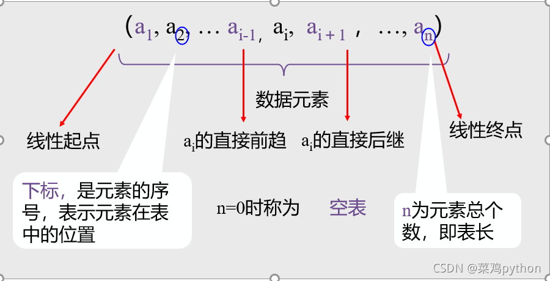

# 线性表

一个线性表是个数据元素的<t bg1>有限序列</t>（非空有限集），是最常用且<t c2>最简单的一种数据结构</t>。

## 参考资料链接

[什么是线性表？](http://data.biancheng.net/view/295.html)

## 线性表特点


- 存在惟一的，“第一个” 数据元素<t c2>（第一个元素仅有后继）</t>
- 存在惟一的，“最后一个” 数据元素<t c2>（最后一个元素仅有前驱）</t>
- 除 “第一个” 之外，集合中 每个数据元素均 只有一个前驱<t c2>（第一个元素无前驱）</t>
- 除 ”最后一个“ 之外，集合中 每个数据元素均 只有一个后继<t c2>（最后一个元素无后继）</t>



## 注意点

- 一个数据元素(element)，可以由若干个数据项(item)组成，常把数据元素称为记录(record)，含有大量记录的线性表又称文件(file)。 可理解为，一个二维表格。数据项为一列，数据元素为一行。
- 线性表中的数据元素可以是各种各样的，但同一线性表中的元素必定具有相同特性，即属同一数据对象，相邻数据元素之间存在着序偶关系。

## 线性表抽象数据类型(ADT）

```txt
ADT List {

  数据对象:D = {a}
  数据关系:R1 = {<a[i-1],a[i]>}

  基本操作:
  
    InitList(&L)
      操作结果: 构造一个空的线性表L

    DestroyList(&L)
      初始条件: 线性表L已存在。
      操作结果: 销毁线性表L
      
    ClearList(&L)
      初始条件: 线性表L已存在。
      操作结果: 将L重置为空表。

    ListEmpty(L)
      初始条件: 线性表L已存在。
      操作结果: 若L为空表，则返回TRUE，否则返回FALSE
    
    ListLength(L)
      初始条件: 线性表L已存在。
      操作结果: 返回L中数据元素个数。
      
    GetElem(L, i, &e)
      初始条件: 线性表L已存在，l < i <ListLength(L) 操作结果; 用e返回L中第i个数据元素的值。

    LocateElem(L, e, compare())
      初始条件: 线性表L已存在，compare()是数据元素判定函数。
      操作结果: 返回L中第1个与e满足关系 compare() 的数据元素的位序。若这样的数据元素不存在，则返回值为0。

    PriorElem(L, cur.e, &pre.e)
      初始条件: 线性表L已存在。
      操作结果: 若 cur.e 是L的数据元素，且不是第一个，则用 pre.e 返回它的前驱，否则操作失败，pre.e 无定义。

    NextElem(L，cur.e, &next.e)
      初始条件: 线性表L已存在。
      操作结果: 若 cur.e 是L的数据元素，且不是最后一个，则用 next.e 返回它的后继，否则操作失败，next.e 无定义。

    ListInsert(&L, i, e)
      初始条件: 线性表L已存在，1 <= i <= ListLength(L) + 1
      操作结果: 在L中第i个位置之前插人新的数据元素eL的长度加1

    ListDelete(&L, i, &e)
      初始条件:线性表L已存在且非空，1 <= i <= ListLength(L)
      操作结果:删除L的第i个数据元素，并用e返回其值，L的长度减1

    ListTraverse(L, visit())
      初始条件: 线性表L已存在。
      操作结果: 依次对L的每个数据元素调用函数 visit()。一旦 visit() 失败，则操作失败。

  } ADT List

```
