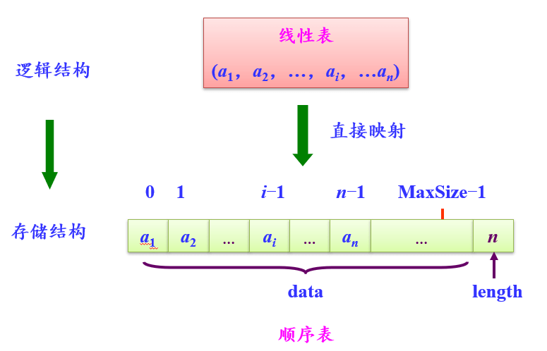
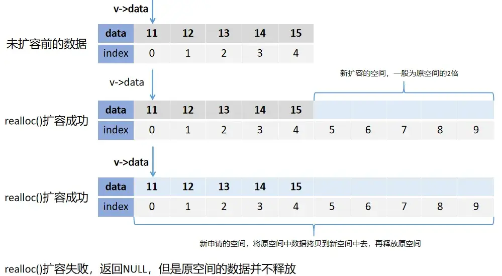
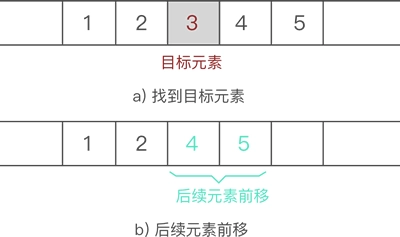

# 线性表-顺序存储

线性表的使用[顺序存储](/notebook/docs/computer/code-design/data-structure/data-basic#顺序存储结构)实现，一般称为<t c1>顺序表</t>。本节的代码内容是非常简单的，除了掌握代码实现以外，还需要了解C语言指针，内存分配与释放，以及内存如何扩容等知识。

## 参考资料链接

- [C语言 指针基础](http://c.biancheng.net/c/80/)
- [5分钟看懂什么是 malloc](https://zhuanlan.zhihu.com/p/105090421)
- [C语言 malloc函数与指针](https://zhuanlan.zhihu.com/p/197918331)
- [C语言 完整实现顺序表 0201_SqList/main.c](https://60f2cac42d-share.lightly.teamcode.com)

## 知识点

- 数据元素<t bg1>逻辑相邻物理存储也相邻</t>，使用<t c2>元素在列表中的下标</t>表示逻辑相邻关系。

- 顺序表<t c2>初始化时需要申请一块完整的地址空间</t>，用于存放数据元素。
  - 由于空间是提前申请的，因此所存放的<t c2>元素数量是固定的</t>。
  - 当插入元素时，需要<t c2>注意内存空间溢出的问题</t>。（当插入前，发现即将溢出，可重新申请地址空间，然后再插入数据）
- 由于每一个数据元素使用的空间是固定的。如果已知某一个位置数据元素的首地址与数据元素的占用空间大小，能够计算出，列表中其他元素的地址。

```txt
  已知：

    单个数据元素占用空间：   c = sizeof(ElemType)
    顺序表首元素内存首地址为：LOC(a1)
  
  求：第i个元素，ai的内存首地址是多少？

    LOC(ai) = LOC(a1) + (i-1) * c
```


:::tip 总结

1. 可随机获取某一个元素，<t c1>查询效率高</t>
2. 插入或者删除时，需要移动大量元素，<t c1>修改效率低</t>
3. 存储结构简单，无需存储额外信息，<t c2>空间利用率高</t>。
4. 需要注意内存溢出风险。
:::

## [线性表ADT](/notebook/docs/computer/code-design/data-structure/linear-list#线性表抽象数据类型adt) 顺序存储实现

公用宏定义

```c
#define TRUE        1   // 真/是
#define FALSE       0   // 假/否
#define OK          1   // 通过/成功
#define ERROR       -3  // 错误/失败

//系统中已有此状态码定义，要防止冲突
#ifndef OVERFLOW
#define OVERFLOW    -2  //堆栈上溢
#endif

//系统中已有此状态码定义，要防止冲突
#ifndef NULL
#define NULL ((void*)0)
#endif

/* 状态码类型 */
typedef int Status;
```

### 顺序表定义

```c
#define LIST_INIT_SIZE 100  // 顺序表存储空间的初始分配量
#define LIST_INCREMENT  10  // 顺序表存储空间的分配增量

/* 顺序表元素类型定义 */
typedef int ElemType;

/*
 * 顺序表结构
 *
 * 注：elem在使用前需要先为其分配内存，且元素从elem[0]处开始存储
 */
typedef struct {
    ElemType* elem;     // 顺序表存储空间的基址（指向顺序表所占内存的起始位置）
    int length;   // 当前顺序表长度（包含多少元素）
    int listsize; // 当前分配的存储容量（可以存储多少元素）
} SqList;
```

### 初始化空顺序表

- 需要理解 `malloc()` 函数分配内存空间的使用。注意处理分配失败的情况。
- 注意给 `SqList` 结构体设置`length`,`listsize`初始值。

```c
/**
 * 操作结果: 构造一个空的线性表L
 */
Status InitList(SqList *L) {
  // malloc 分配指定容量的内存，如果分配失败 返回 NULL
  (*L).elem = (ElemType*) malloc(LIST_INIT_SIZE * sizeof(ElemType));

  if ((*L).elem == NULL) {
    // 如果分配失败 直接退出，并返回对应错误码
    exit(OVERFLOW);
  }

  (*L).length = 0; // 设置默认长度
  (*L).listsize = LIST_INIT_SIZE; // 设置列表最大长度

  return OK;
}
```

### 销毁顺序表

- 需要理解 `free()` 函数释放内存空间的使用。
- 注意重置 顺序表的 `length`,`listsize` 数据

```c
/**
 * 初始条件: 线性表L已存在。
 * 操作结果: 销毁线性表L
 */
Status DestroyList(&L) {
  // 下列情况会导致L不存在
  //  1. 当未初始化线性表，直接调用 DestroyList 时
  //  2. 重复调用 DestroyList 时

  // 确保线性表L已经存在。
  if (L == NULL || (*L).elem == NULL) {
    return ERROR;
  }

  // 释放 顺序表 内存空间
  free((*L).elem);

  // 重置 顺序表 结构体数据
  (*L).elem = NULL;
  (*L).length = 0;
  (*L).listsize = 0;

  return OK;
}
```

### 清空顺序表

- 要注意<t b l l2>清空</t>与<t b l l2>销毁</t>的区别
  - 清空: 只是<t l l2>将顺序表的长度设为0</t>，该顺序表任然可以继续使用。在表中继续添加元素时，会覆盖原有值。
  - 销毁: 释放顺序表内存空间，不再使用。如果需要再次使用，需要重新初始化。

```c
/**
 * 初始条件: 线性表L已存在。
 * 操作结果: 将L重置为空表。
 */
Status ClearList(&L) {
  // 确认 顺序表存在
  if (L == NULL || (*L).elem == NULL) {
    return ERROR;
  }
  // 置为空表
  (*L).length = 0;
  
  return OK;
}
```

### 判断顺序表是否为空

```c
/**
 * 初始条件: 线性表L已存在。
 * 操作结果: 若L为空表，则返回TRUE，否则返回FALSE
 */
Status ListEmpty(L) {
  // 确认 L 存在
  if (L.elem == NULL) {
    return ERROR;
  }
  // 长度 为 0，表示 空表
  if (L.length == 0) {
    return TRUE;
  }
  // 不为空表
  return FALSE;
}
```

### 获取顺序表长度

```c
/**
 * 初始条件: 线性表L已存在。
 * 操作结果: 返回L中数据元素个数。
 */
int ListLength(L) {
  // 确认 L 存在
  if (L.elem == NULL) {
    return ERROR
  }
  return L.length;
}
```

### 获取某位置元素的值

- 时间复杂度为 $O(1)$
- 注意： <t l l2>参数 i 定义是<t c2>位置</t></t>。 所以i的取值区间为 $1 <= i <= L.length$

```c
/**
 * 初始条件: 线性表L已存在，l <= i <= ListLength(L)
 * 操作结果; 用e返回L中第i个数据元素的值。
 */
Status GetElem(L, i, ElementType* e) {
  // 确认 i 的值有效
  if (i < 1 || i > L.length + 1) {
    return ERROR;
  }
  // 确认 L 存在
  if (L.elem == NULL) {
    return ERROR;
  }
  // 修改 指针 e 的值
  *e = L.elem[i-1];

  return OK;
}
```

### 获取某元素的位置

- 第二个参数e,是 `Compare` 函数的第二个形参。
- 第三个参数`Compare`是一个函数地址，用于比较元素是否相等
- 时间复杂度为 $O(n)$
- 注意：<t l l2>返回的值为<t c2>位置号</t></t>,所以区间为 $i<position<L.length$

```c
/**
 * 初始条件: 线性表L已存在，compare()是数据元素判定函数。
 * 操作结果: 返回L中第1个与e满足关系 compare() 的数据元素的位序。若这样的数据元素不存在，则返回值为0。
 */

int LocateElem(SqList L, ElemType e, Status(Compare)(ElemType, ElemType)) {

  // 确保 L 存在
  if (L.elem == NULL) {
    return ERROR;
  }

  // 循环遍历比较 顺序表中元素，与指定元素 是否相等，
  for (int i = 0; i<L.length; i++) {
    if (Compare(L.elem[i], e)) {
      return i+1;
    }
  }

  return 0;
}
```

### 获取某元素前驱元素

```c
/**
 * 初始条件: 线性表L已存在。
 * 操作结果: 若 cur.e 是L的数据元素，且不是第一个，则用 pre.e 返回它的前驱，否则操作失败，pre.e 无定义。
 */ 

Status PriorElem(SqList L, ElemType cur_e, ElemType* pre_e) {
  // 确保L， 并最少有2个元素
  if (L.elem == NULL || L.length < 2) {
    return ERROR;
  }

  // 循环遍历比较 顺序表中元素，与指定元素 是否相等，
  for (int i = 1; i<L.length; i++) {
    if (L.elem[i] == e) {
      *pre_e = L.elem[i-1]
      return OK;
    }
  }

  return ERROR;
}
```

### 获取某元素后继元素

```c
/**
 * 初始条件: 线性表L已存在。
 * 操作结果: 若 cur.e 是L的数据元素，且不是最后一个，则用 next.e 返回它的后继，否则操作失败，next.e 无定义。
 */

 Status NextElem(SqList L, ElemType cur_e, ElemType* pre_e) {
  // 确保L， 并最少有2个元素
  if (L.elem == NULL || L.length < 2) {
    return ERROR;
  }

  // 循环遍历比较 顺序表中元素，与指定元素 是否相等，
  for (int i = 0; i<L.length-1; i++) {
    if (L.elem[i] == e) {
      *pre_e = L.elem[i+1]
      return OK;
    }
  }

  return ERROR;
}
```

### 重点：<t c1>在某位置插入元素</t>


- 插入时是<t bg1>从列表最后一个元素开始</t>，逐步往后移一个位置。
- 循环的终止条件是：<t c1>i = insertPos - 1;</t>，<t c2>一直要移动到插入位置的前一个</t>。
- <t c1>空出插入位置</t>，放入需要插入的新元素。
- 时间复杂度为 $O(n)$

```c
// 核心代码
// insetPost插入位置，newNode 插入元素
for (int i = L.length - 1; i >= insertPos - 1; i--) {
  L.list[i+1] = L.list[i];
}
L.list[insertPos - 1] = newNode;
```

- 插入元素时，注意<t c2>额外处理数据溢出逻辑</t>



- 完整代码如下，[可在线查看代码并运行](https://onecompiler.com/c/3ydhxzw6t)
- 注意： <t l l2>参数 i 定义是<t c2>位置</t></t>。 所以i的取值区间为 $1 <= i <= L.length$

```c
/**
 * 初始条件: 线性表L已存在，1 < i < ListLength(L) + 1
 * 操作结果: 在L中第i个位置之前插人新的数据元素eL的长度加1
 */

Status ListInsert(SqList* L, int i, ElemType e) {
  // 确保L存在
  if (L == NULL || (*L).elem == NULL) {
    return ERROR;
  }

  // 确保 位置参数i，的取值区间
  if (i<1 || i>(*L).length+1) {
    return NULL;
  }

  // 处理 内存溢出 逻辑
  ElemType* newbase;
  if ((*L).length == (*L).listsize) {
    newbase = (ElemType*) realloc((*L).elem, ((*L).listsize + LIST_INCREMENT) * sizeof(ElemType));
    if (newbase == NULL) {
      exit(OVERFLOW);
    }

    (*L).elem = newbase;
    (*L).listsize = (*L).listsize + LIST_INCREMENT;
  }

  /*
    // 方案1：使用指针方案

    ElemType* q = &(*L).elem[i-1]; // q为插入位置
    ElemType* p;
    for (p = &(*L).elem[(*L).length - 1]; p >= q; p--) {
      *(p+1) = *p;
    }
    *q = e;
  */

  // 方案2：使用数组方案
  for (int j = (*L).length - 1; j >= i - 1; j--) {
    (*L).elem[j+1] = (*L).elem[j];
  }
  (*L).elem[i-1] = e;

  (*L).length += 1;

  return OK;
}
```

### 重点：<t c1>删除某位置元素</t>

- 删除元素图示



- 删除时需要先处理将要移除的元素。移动后会丢失对应数据。
- 删除时,从移除位置开始，<t bg1>往前移动一个位置</t>
- 时间复杂度为 $O(n)$

```c
// 核心代码
// deletePos 删除位置
for (int i = deletePos; i < L.length - 1; i--) {
  L.list[i-1] = L.list[i];
}
```

- 完整代码如下，[可在线查看代码并运行](https://onecompiler.com/c/3ydjcajfg)
- 注意： <t l l2>参数 i 定义是<t c2>位置</t></t>。 所以i的取值区间为 $1 <= i <= L.length$

```c
/**
 * 初始条件:线性表L已存在且非空，1 < i < ListLength(L)
 * 操作结果:删除L的第i个数据元素，并用e返回其值，L的长度减1
 */

Status ListDelete(SqList* L, i, ElemType *e) {
  // 确保 L 可用
  if (L == NULL || (*L).elem == NULL) {
    return ERROR;
  }

  // 确保 i 在正确的区间
  if (i<1 || i > (*L).length+1) {
    return ERROR;
  }

  // 方案1: 使用指针
  // ElemType* p = &(*L).elem[i-1]; // 需要删除的 地址
  // *e = *p; // 将要移除的元素 赋值给 指针e;
  // for( p+=1; p<= (*L).elem + (*L).length - 1; p++) {
  // // 先将p指针后移1位， 循环终止是，最后一个地址
  //   *(p-1) = *p;
  // }

  // 方案2: 数组
  *e = (*L).elem[i-1]; // 将要移除的 赋值给 指针e;
  for(int j = i; j < (*L).length; j++) { // 从 位置i,开始，逐个往前移动
    (*L).elem[j-1] = (*L).elem[i];
  }

  (*L).length -= 1;

  return OK;
}

```

### 遍历顺序表

- 参数`visit()` 是传入的遍历操作

```c
/**
 * 初始条件: 线性表L已存在。
 * 操作结果: 依次对L的每个数据元素调用函数 visit()。一旦 visit() 失败，则操作失败。
 */

Status ListTraverse(SqList L, void(Visit)(ElemTYpe)) {
  if (L.elem == NULL) {
    return ERROR;
  }

  for (int i; i< L.length; i++) {
    Visit(L.elem[i]);
  }

  return OK;
}
```

## 顺序表应用例子

### 求2个集合的并集

**题目：** 两个线性表LA和LB分别表示两个集合A和B(即线性表中的数据元素即为集合中的成员)，合并为一个集合。

$A = A \cup B$

- 举例

```txt
输入数据：
  A = (1,2,3,4);
  B = (1,4,5,6);
输出数据：
  A = (1,2,3,4,5,6);
```

- 思路
  - 扩大线性表 LA，将存在于线性表LB中而不存在于线性表LA中的数据元素插人到线性表LA中去。
  - 从线性表 LB 中依次取得每个数据元素，并依值在线性表LA中进行查访，若不存在，则插人LA。
  - 需要注意，<t c2>可以使用线性表ADT</t>来描述算法。（不考虑具体实现）
- 时间复杂度分析
  - 循环遍历 LB 中元素： $O(LenB)$
    - 获取 LB 指定位置元素： $O(1)$
    - 再<t c1>嵌套查找</t> Bi 是否在 LA 中存在: $O(LenA)$
    - 每一次插入都在<t c2>LA的末尾插入</t>： $O(1)$
  - 总复杂度：$\color{red} O(LenB \times LenA) \Longrightarrow O(n^2)$
- 伪代码如下： [点击查看可运行代码](https://onecompiler.com/c/3ydmj74gs)

```c
// 比较函数
Status Compare(ElemType a, ElemType b) {
  if (a == b){
    return TRUE;
  }
  return FALSE
}

// 合并函数
Status Union(SqList* A, SqList B) {
  // 遍历 Lb中每一个元素
  for (int i = 1; i <= B.length; i++) { // O(n)
    GetElem(B, i, bi) // O(1)
    // 如果 B中元素不在A中存在
    if (LocateElem(*A, bi, Compare) == 0) { // O(n)
      // 将该元素插入A的末尾
      ListInsert(A, (*A).length + 1, bi); // O(1)
    }
  }
}
```

### 合并2个有序表

**题目：** 已知线性表LA和LB中的数据元素按值非递减有序排列，现要求将LA和LB归并为一个新的线性表LC，且LC中的数据元素仍按值非递减有序排列。

$C = A \& B$

- 举例

```txt
输入数据：
  A = (1,2,3,4);
  B = (1,4,5,6);
输出数据：
  C = (1,1,2,3,4,4,5,6);
```

- 思路
  - LC中的数据元素或是LA或LB中元素
  - 只要先设LC为空表，然后将LA或LB中的元素逐个插人到LC中即可。
  - 可设两个位置 i 和 j分别指向LA 和 LB中某个位置元素, k为LC的列表的位置。
    - 循环取出对应列表元素， 比较 $A_i$ 与 $B_j$ 大小
    - 当前 $$C_{k++} = \begin{cases} A_i, A_i >= B_j, i++ \\ B_j, A_i < B_j, j++ \end{cases}$$
- 时间复杂度分析
  - 循环遍历 LA,LB 长度较少的一个表： $O(min(LenA,lenB))$
    - 每次获取 LA,LB 中元素： $O(1)$
  - 继续遍历剩下的一个长度较长的表：$O(max(LenA,lenB) - min(LenA,lenB))$
  - 每次插入都在 <t c2>LC的末尾插入</t>： $O(1)$
  - 总复杂度：$\color{red} O(LenA + LenB) \Longrightarrow O(n)$

- 伪代码如下：

```c
Status MergeList(SqList A, SqList B, SqList* C) {
  int i = 1,j = 1,k = 1;
  InitList(C);

  // 当 La,Lb 都存在元素时， 取出ai,bj 将较大的元素插入Lc中
  while(i <= A.length && j <= B.length) { // O(n)
    GetElem(A, i, ai); // O(1)
    GetElem(B, j, bj); // O(1)
    if (ai >= bj) {
      InsertList(C, k, ai); // O(1)
      i += 1; // i位置后移，取 La 下一个位置的元素
    } else {
      InsertList(C, k, bj); // O(1)
      j +=1 ; // j位置后移，取 Lc 下一个位置的元素
    }
    k += 1; // k位置后移，Lc下一个插入位置
  }

  // 假如 La 还有多余的元素未插入 Lc
  while(i <= A.length) { // O(n)
    GetElem(A, i, ai);
    InsertList(C, k, ai);
    i += 1;
    k += 1;
  }

  // 假如 Lb 还有多余的元素未插入 Lc
  while(j <= B.length) { // O(n)
    GetElem(B, j, bj);
    InsertList(C, k, bj);
    j += 1;
    k += 1;
  }
}
```
