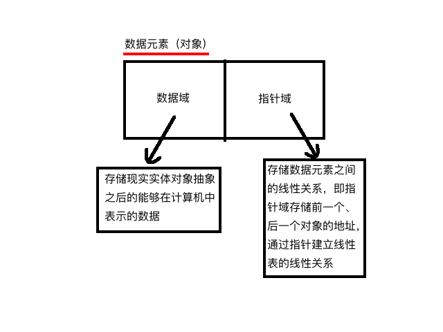
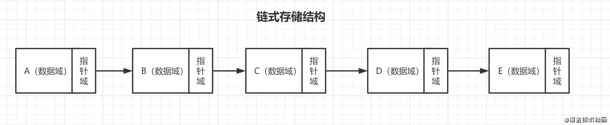
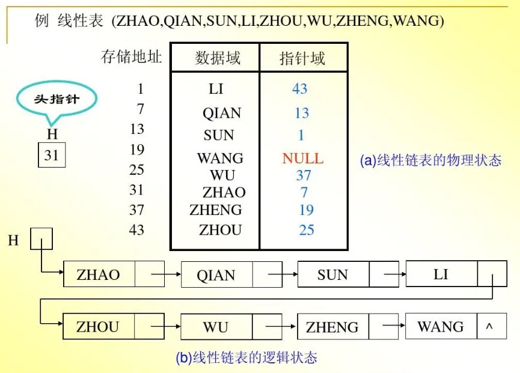

# 线性表-链式存储

线性表的使用[链式存储](/notebook/docs/computer/code-design/data-structure/data-basic#链式存储结构)实现又叫<t c1>链表</t>。

## 参考资料链接

- [C语言 指针基础](http://c.biancheng.net/c/80/)
- [5分钟看懂什么是 malloc](https://zhuanlan.zhihu.com/p/105090421)
- [C语言 malloc函数与指针](https://zhuanlan.zhihu.com/p/197918331)

## 知识点

- 数据元素<t bg1>逻辑相邻物理存储不一定相邻</t>。
- 由于存储位置不相邻，不能像顺序存储一样，使用位置来表示逻辑相邻关系。因此每一个节点中，需要添加额外数据（指向逻辑相邻元素的地址），来表示逻辑相邻。所以一个数据元素，分为两部分。<t c2>数据域</t>、<t c2>指针域</t>。

- 链式存储基本意图表示

- 顺序表链式存储举例图示

## [线性表ADT](/notebook/docs/computer/code-design/data-structure/linear-list#线性表抽象数据类型adt)链式存储实现

## 链表表实际应用
