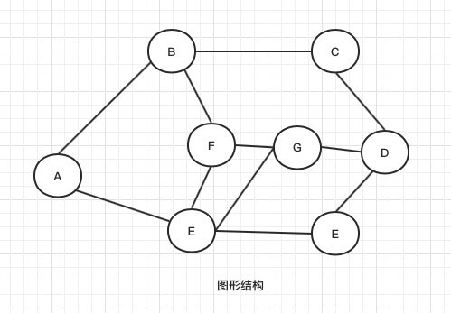

# 数据结构基础

## 参考资料链接

- [什么是数据结构?](https://zhuanlan.zhihu.com/p/43859497)
- [数据结构理解](https://zhuanlan.zhihu.com/p/108368771)
- [数据结构基础概念汇总](https://zhuanlan.zhihu.com/p/80711691)
- [ADT抽象数据类型简介](https://blog.csdn.net/qq_44762986/article/details/104160343)

## 数据结构基础知识总览


## 什么是数据结构？

- 数据结构 是介于 **数学，计算机硬件，计算机软件** 之间的学科
- 数据结构 是一门研究**非数值计算**的程序设计问题中**计算机的操作对象**以及它们之间**关系的操作**等的学科。


- 计算机解决实际问题的步骤:
  1. 从生活中实际问题抽象出数学模型
  2. 设计解决此数学问题的算法
  3. 编译、调试程序，直至得到最终答案

- 生活中实际问题的几大分类
  - 例1 :图书管理系统、新生信息登记系统、酒店入住登记系统等  此类文章管理的数学模型中，**计算机处理的对象间一般存在着一对一的线性关系，所以叫线性数据结构。**

  - 例2: 计算机与人机对弈问题、游戏中触发模型和步骤等 此类游戏博弈的数学模型中，**计算机的处理对象间一般存在着一对多的数据关系，它叫树形数据结构。**因为对应关系可看作一个倒置的树，此类关系结构是非线形的。

  - 例3: 人际关系脉络关系、城市公交问题等 此类多交叉路口交通灯的数学模型中，**计算机处理的对象间一般存在着多对多的数据关系，它叫图状数据结构。**通过图示表示出来是类似于“网”状，所以又叫网状数据结构，此类关系结构是非线性的。

- **程序设计 = 数据结构 + 算法**
- **数据结构 = 数据 + 结构**
  - **数据：** 描述客观事物的符号（程序操控的原料，存储在计算机上）
  - **结构：**
    - 数据的**逻辑结构**
    - 数据的**存储结构**


## 定义与术语

### 数据 (data)

- **数据:** 数据是对客观事物的符号总称，是计算机中所有能输入到计算机中并被计算机程序处理的符号关系的总称
- **数据<i className="n c-1">项</i>:** 数据项是数据最小的<i className="n c-2">不可分割单位</i>。（又称数据域,字段）
- **数据<i className="n c-1">元素</i>:** 一系列数据项组成数据元素。 数据元素是数据的<i className="n c-2">基本单位</i>。在计算机中通常考虑做一个整体进行处理。（又称数据节点，数据行）
- **数据<i className="n c-1">对象</i>:** <i className="n c-2">性质相同的</i>数据元素的集合，是数据的一个子集。（又称数据表）

> 数据结构关注的是：数据元素之间的**关系**，和 对数据元素的**操作**。 与具体的数据项的内容无关


### 数据结构（DS: data structure）

- **数据<i className="n c-1">结构</i>:** 相互之间存在一种或多种<i className="n c-2">特定关系</i>的数据元素的集合
  - 数据结构的形式定义为一个2元组：<i className="n b bg-1">DS = (D,S)</i>
    - DS是指 `data structure` 简写
    - D是指 数据元素的有限集合<i className="n c-2">(元素集合)</i>
    - S是指 数据元素之间关系有限集合<i className="n c-2">(元素间关系集合)</i>


- **数据<i className="n c-1">类型</i>:** 是指一个<i className="n c-2">值的集合</i>，以及这个集合上的<i className="n c-2">一组操作</i> 的总称
  - 值的类型
    - **原子类型:** 其值**不可再分**的数据类型。 与 数据项 对比
    - **结构类型:** 其值**可再分**的数据类型。 与 数据元素 对比
      - 固定聚合类型：值的数目，和成分 完全固定。（比如：复数定义）
      - 可变聚合类型：值的数目，和成分 不固定。
  - 举例：

    ```c++
    // 简单类型
    int a = 100; // a是 值整数 集合
    a += 1; // 整数可以 进行 四则运算，
    a --; // 整数可以 自增/自减

    // 结构类型 student
    struct student {
      char *name;  //姓名
      int age;  //年龄
      float score;  //成绩
    };
    student s1 = {'Tom', 12, 100 }; // s1 是 student 集合
    ```


### 抽象数据类型（ADT: abstract data type）

- 定义一个<i className="n c-2">数学模型</i>，以及该模型上的<i className="n c-2">一组操作</i>。（抽象数据类型，和数据类型本质是一样的）[(ADT介绍CSDN博文>)](https://blog.csdn.net/qq_44762986/article/details/104160343)
- 抽象是指：该类型只 <i className="n c-1">与其逻辑特性有关</i>，不管其如何具体硬件实现实现。（无论使用什么机器，什么高级编程语言）
- 由于不再局限于具体实现，<i className="n c-1">将使用和实现分离</i>。所以更加有复用性，更容易能够解决实际问题
- 举例： 比如整数 `int a=1；`
  - 在不同机器，不同操作系统，不同高级语言中，具体实现可能不是一样的
  - 但是其定义的数学特性是相同的，都可以进行 加减乘除。在开发者看来，这都是一样的。
  - 因此，<i className="n bg-1">抽象</i>的意义，在于一致的逻辑特性。


- 抽象数据类型的形式定义为一个3元组：<i className="n b bg-1">ADT = (D,S,P)</i>
  - ADT是指 `abstract data type` 简写
  - D是指 数据元素的有限集合<i className="n c-2">(元素集合)</i>
  - S是指 数据元素之间关系有限集合<i className="n c-2">(元素间关系集合)</i>
  - P是指 数据元素元素的基本操作<i className="n c-2">(元素的操作集合)</i>

- 抽象类型描述格式：

    ```txt
      ADT 抽象数据类型名 {
        数据对象：<数据对象定义> // 用 伪代码 描述 
        数据关系：<数据关系定义> // 用 伪代码 描述 
        基本操作：<基本操作定义>
          操作名(参数列表)
            初始条件：<初始化条件描述> // 如果初始化条件为空则省略
            返回结果：<返回结果描述>
      } ADT 抽象数据名
    ```

- 抽象类型举例: 复数定义

  ```txt
  ADT Complex{
    数据对象：D={r,i|r,i 为实数}
    数据关系：R={<r,i>}
  
    基本操作：
      InitComplex(&C,re,im)
        操作结果：构造一个复数 C，其实部和虚部分别为 re 和 im
        
      DestroyCmoplex(&C)
        操作结果：销毁复数 C

      Get(C,k,&e)
        操作结果：用 e 返回复数 C 的第 k 元的值

      Put(&C,k,e)
        操作结果：改变复数 C 的第 k 元的值为 e

      IsAscending(C)
        操作结果：如果复数 C 的两个元素按升序排列，则返回 1，否则返回 0

      IsDescending(C)
        操作结果：如果复数 C 的两个元素按降序排列，则返回 1，否则返回 0

      Max(C,&e)
        操作结果：用 e 返回复数 C 的两个元素中值较大的一个

      Min(C,&e)
        操作结果：用 e 返回复数 C 的两个元素中值较小的一个
  } ADT Complex
  ```

## 数据的**逻辑结构**

- 数据元素集合之间的抽象逻辑关系
  - <i className="n b c-2">抽象</i>：是指独立于计算机硬件，与高级编程语言具体实现、数据的物理存储无关
  - <i className="n b c-2">逻辑关系</i>：是指数据元素之间的关联
- 逻辑结构决定了 **数据元素的基本操作**，比如：创建、添加、移动、删除等操作

- <i className="n bg-2">如何理解 <i className="n b">前驱/后继 “对应关系”？</i></i>

  可简单理解为，**某一个节点信息内包括其前一个或后一个节点信息**（比如“信息x”）。通过某节点“信息x”，可以获取到该节点的前一个或后一个节点信息。用图形化的方式理解，就是连一根线，表示它们之间有“关系”，通过这根线，互通这两个节点信息。

- <i className="n bg-2">逻辑关系，1:1，1:多，多:多关系，是如何在代码中体现的？</i>

  逻辑关系在代码中的实现，是根据选择的程序语言和存储结构而决定的。一般来讲，在顺序存储中，可以用<i className="n b c-1">元素下标</i>确定元素间关系。在链式存储中，每一个节点需要<i className="n b c-1">开辟一个空间来存放，前驱/后继节点的地址信息</i>，来确定元素间关系。

### 集合结构 (0关系)

- 元素集合在一起形成的集合体,相互堆积起来
- 数据元素之间<i className="n b c-2">无其他的关系</i>，仅仅属于处于一集合之中


### 线性结构 (1:1关系)

- 数据元素之间存在<i className="n b c-2">1对1的关系</i>
- 开始节点，终端节点具有唯一性
- 除开始节点，终端节点，其他节点存在 唯一前驱与唯一后继


### 树形结构 (1:x关系)

- 数据元素之间存在着<i className="n b c-2">1对多的关系</i>（非线性结构）
- 每一个数据元素有<i className="n b c-2">0个或1个</i>前驱节点，与<i className="n b c-2">0个或多个</i>后继节点
- 可形成 线性结构（即线性结构是一种特殊的树）


### 图状结构 (x:x关系)

- 数据元素之间存在着<i className="n b c-2">多对多的关系</i>（非线性结构，又称网状结构）
- 每一个数据元素有<i className="n b c-2">0个或多个</i>前驱节点，与<i className="n b c-2">0个或多个</i>后继节点
- 可形成 线性结构/树形结构（即 线/树 型结构是一种特殊的 图状结构）



## 数据的**存储结构**

- 存储结构定义了数据元素在<i className="n b c-2">计算机硬件机器内部如何存储</i>
- 由于是硬件存储，也叫做<i className="n b c-2">物理存储结构</i>

### 顺序存储结构

- 把逻辑上相邻的数据存储在物理位置上相邻的存储单位
- 用物理位置上的相邻来体现逻辑上的相邻
- 优点
  - 此种存储结构的又在于节省了存储空间，因为分配给数据的存储单元完全用于了数据的存储，
  - 数据之间的逻辑关系没有占用存储空间，
  - 可以实现对数据的随机存取，每个节点对应一个序号，由这个序号可以计算出数据的存储地址
- 缺点
  - 缺点在不方便数据的修改，对数据的插入和删除可能要移动一系列的数据。


### 链式存储结构

- 逻辑上相邻的两个数据元素不一定在物理位置上也要相邻
- 数据元素之间的相邻是用添加的指针来标识的

- 优点
  - 不要求在物理上的相邻
  - 在进行插入，删除等时，只需要改变相邻节点的指针域，不必移动数据的位置
  - 添加/删除 更高效

- 缺点
  - 存储数据的一部分单元用于了存储数据之间的逻辑关系，所以**存储空间利用率低**
  - 相邻的节点在物理位置上不一定相邻，所以不能进行随机访问，**查询效率低**


### 索引存储结构

- 索引结构在存储数据元素的同时，还建立了一个附加的索引表
- 索引表中的每一项称为索引项（关键字，地址），关键字唯一标识一个数据元素 ，地址是指向数据元素的指针
- 优点
  - 存取数据元素，在进行插入，删除等时，只需要移动相应索引表中的地址，不必移动数据，
  - 故而大大提高了数据的查找速度
- 缺点：
  - 存储空间的利用率低


### 散列(哈希)存储结构

- 根据数据元素的关键字通过哈希函数计算出一个数值用做数据元素的存储地址

- 优点
  - 查找速度快，只需要给出关键字可立即计算出该数据元素的地址
- 缺点
  - 存储数据元素不存储数据之间的逻辑关系，所以只适合进行快速查找和插入的场合


## 数据的**运算**

### 查找

根据某一条件，遍历查找满足条件的数据元素

### 添加

向数据元素集合中，添加数据元素

### 删除

根据某一条件，删除满足条件数据元素

### 排序

根据某一条件，将数据元素集合中，满足条件的元素删除
