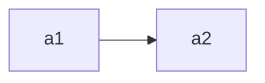
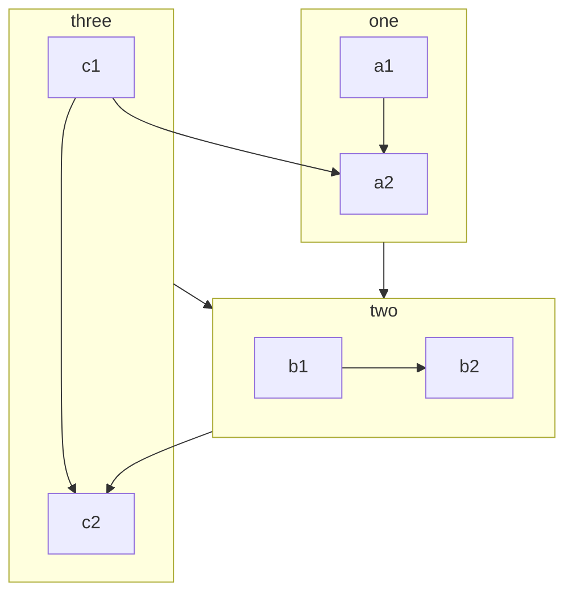

# 流程图 Flow chart

- [文档地址](https://mermaid-js.github.io/mermaid/#/flowchart)

- flowchart 标记
- 方向 orientations
  - TB - top to bottom
  - TD - top-down/ same as top to bottom
  - BT - bottom to top
  - RL - right to left
  - LR - left to right
- 形状 shapes
  - `()`
  - `(())`
  - `([])`
  - `{}`
  - `{{}}`
  - `[]`
  - `>]`
  - `[[]]`
  - `[()]`
  - `[//]`
  - `[\\]`
  - `[/\]`
  - `[\/]`
- 线类型
  - 实线
  - `-->`
  - `---`
  - 实线+文字
    - `-- text --` or `--|text|--`
    - `- text -->` or `-- |text|`
  - 虚线
    - `-.->`
    - `-. text .->`
  - 粗线
    - `==>`
    - `== text ==>`
  - 多点连线
    - `A -- t1 --> B -- t2 --> C`
    - `A --> B & C -> D`
      - ` A --> B / A --> C / B --> D / B --D `
    - `A & B --> C & D`
      - `A --> C / B --> C / A --> D / B --> D`
- 箭头类型
  - `--X`
  - `--o`
  - `<-->`
- 子图
  - 多图
  - 子图方向
- 样式自定义
- 配置

## 练习1

- ex1

- 子图

