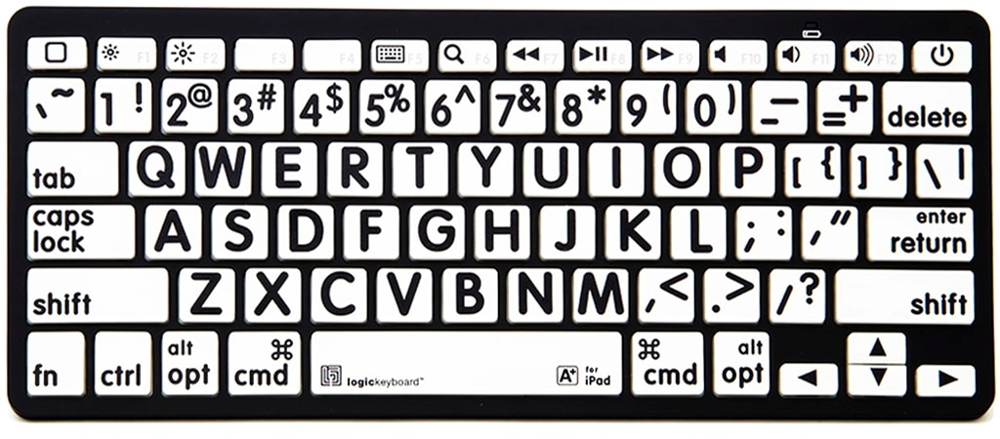

# 键盘键位

## 字母键

### 第一行

- qwert yuiop
- 七碗鹅肉汤，已无一我婆

### 第二行

- asdfg hjkl
- 爱上对方过后就哭了

### 第三行

- zxcv bnm
- 自行车 未 帮你买

## 符号键

- 左边第一列
  - ~`
  - tab
  - caps-lock
  - shift
  - ctrl
- 右边小拇指
  - 第一行
    - 英文 `{}\`
      - 上档 `[]|`
    - 中文 `【】、`
      - 上档 `「」｜`
  - 第二行
    - 英文 `;'`
      - 上档 `:"`
    - 中文 `；‘`
      - 上档 `：”`
  - 第三行
    - 英文 `,./`
      - 上档 `<>?`
    - 中文 `，。`
      - 上档 `/《》？`
- 数字键
  - 1 !
  - 2 @
  - 3 \#
  - 4 $
  - 5 %
  - 6 ^
  - 7 &
  - 8 \*
  - 9 (
  - 0 )
  - \- =
  - _ +
